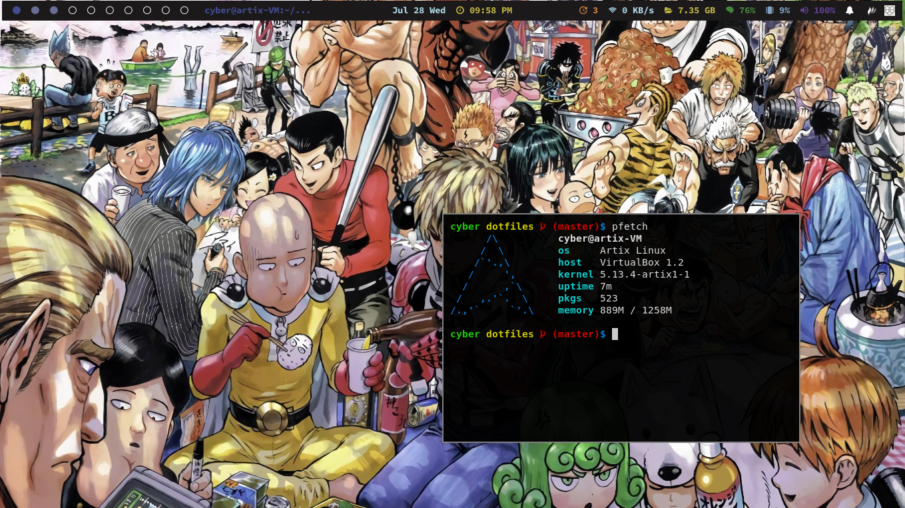

# dotfiles



### Essentials packages
``` 
xf86-video-intel xorg xorg-xinit bspwm sxhkd feh kitty firefox arandr
```
### Install yay
```
pacman -S --needed git base-devel
git clone https://aur.archlinux.org/yay.git
cd yay
makepkg -si
```
### Essential packages from AUR
```
polybar-git picom-ibhagwan-git
```
### Install other packages
```
cat pkgs.txt | xargs sudo pacman -noconfirm -S
```
